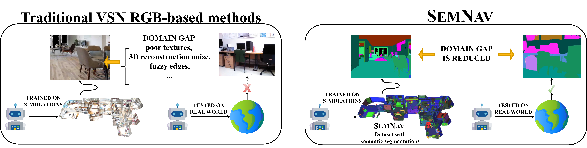

# SemNav: A Semantic Segmentation-Driven Approach to Visual Semantic Navigation

## Overview

SemNav is a visual semantic navigation model ready to be deployed into any robot. It achieves successful object goal navigations using mainly semantic segmentation information.

<p align="center">

</p>

In this repository we release the SemNav dataset, code and trained models detailed in our <a href="https://arxiv.org/abs/2506.01418"> [paper]</a>.

**If you use any content of this repo for your work, please cite the following bib entry:**

    @article{semnav,
    author={Flor-Rodr{\'i}guez, Rafael and Guti{\'e}rrez-{\'A}lvarez, Carlos and Acevedo-Rodr{\'i}guez, Francisco~J. and Lafuente-Arroyo, Sergio and L{\'o}pez-Sastre, Roberto~J.},
    title={SEMNAV: A Semantic Segmentation-Driven Approach to Visual Semantic Navigation},
    journal={ArXiv},
    year={2025},
    month={June},
    day={02},    
    doi={10.48550/arXiv.2506.01418},
    url={https://doi.org/10.48550/arXiv.2506.01418}
    }    


---

## Install locally

To run our code you need a machine that runs Ubuntu in order to install all the dependencies. We have tested our code on Ubuntu 20.04, 22.04 and 24.04. The most easy way is to install miniconda (if you don't already have it). You can download it from [here](https://www.anaconda.com/docs/getting-started/miniconda/install#macos-linux-installation).

Once you have installed miniconda, you can setup the environment by running the following script we prepared:

```bash
bash scripts/setup_environment.sh
```

If you want to install the dependencies manually, you can follow the instructions below.

<details>
<summary>Manual installation (Click to expand/collapse)</summary>

Clone the repository and set up the environment:

```bash
git clone https://github.com/gramuah/semnav.git
conda create -n semnav python=3.9 cmake=3.18.0
conda activate semnav
```

### Install Habitat-Sim

```bash
git clone --depth 1 --branch v0.2.2 https://github.com/facebookresearch/habitat-sim.git
cd habitat-sim/
pip install -r requirements.txt
python setup.py install --headless
cd ..

```

### Install torch

```bash
pip3 install torch torchvision torchaudio
```

### Install Habitat-Lab

```bash
pip install gym==0.22.0 urllib3==1.25.11 numpy==1.25.0 pillow==9.2.0
git clone https://github.com/carlosgual/habitat-lab.git
cd habitat-lab/
python setup.py develop --install
cd ..
```

### Install other dependencies

```bash 
pip install wandb
conda install protobuf
```

### Install semnav

```bash
pip insatll -e .
```
</details>

---

## Data setup


We provide two datasets, **SemNav 40** and **SemNav 1630**, for leveraging semantic segmentation information. These datasets will be available after the publication of the paper.

- **SemNav 1630**: Built using human-annotated semantic labels from [HM3D Semantics](https://github.com/facebookresearch/habitat-lab/tree/main/habitat/data/datasets/hm3d_semantics).
- **SemNav 40**: Derived by mapping these annotations to the 40 categories of [NYUv2](https://cs.nyu.edu/~silberman/datasets/nyu_depth_v2.html).

| Dataset      | Download Link |
|--------------|----------------|
| **SemNav 40**  | Available after publication |
| **SemNav 1630** | Available after publication |

Additionally, download the **ObjectNav HM3D episode dataset** from [this link](https://github.com/facebookresearch/habitat-lab/blob/main/DATASETS.md#task-datasets).


---

## Docker Setup

If you want to run the code in a Docker container (for example to run it into a compute server as we do), follow the instructions below. You will need a docker installation with [GPU support](https://docs.nvidia.com/datacenter/cloud-native/container-toolkit/latest/install-guide.html). We also use rootless containers, which means that the container shares the same user as the host. That is why first of all you need to put your user name and user id in the [Dockerfile](docker/Dockerfile) (lines 42-43). You can get your user id by running `id -u`.

### Build the Docker Image

```bash
docker build -t semnav:latest -f docker/Dockerfile .
```

This builds the Docker image with the entrypoint prepared to run the [training script](scripts/launch_training.sh). You can modify the entrypoint to run other scripts, for example the [evaluation script](scripts/launch_eval.sh), but you will need to rebuild the image.

### Run the Docker Container

```bash
docker run \ 
  -v /home/your_username/local_path_to_your_data/:/home/your_username/code/data \ # mount the data folder
  -v /home/your_username/local_path_to_your_code/semnav:/home/your_username/code \ # mount the code folder (so you can modify the code locally and still deploy it via docker)
  --env NVIDIA_VISIBLE_DEVICES=5,6 \ # If you want to use specific GPUs on multi-GPU systems
  --env WANDB_API_KEY=your_api_key \ # If you want to use wandb, if not ignore
  --name semnav_container \
  --runtime=nvidia \
  semnav
```

### Access the Running Container

```bash
docker exec -it semnav_container /bin/bash
```

### Stop the Container

```bash
docker stop semnav_container
```

The Dockerfile sets up the complete environment, including:
- CUDA and cuDNN for GPU support
- Conda for environment management
- Habitat-Sim and Habitat-Lab for simulation tasks
- Essential Python libraries: PyTorch, torchvision, torchaudio

Ensure the entry script [entrypoint.sh](docker/entrypoint.sh) is executable.

---

## Pretrained Checkpoints

We provide multiple trained configurations. The **pretrained_ckpt** directory contains checkpoints for the **SemNav 40** dataset in three setups:
- **Only Semantic**
- **Semantic+RGB**
- **Semantic+RGB+RL**

Checkpoints will be available after publication.

---

## Training

To train a model from scratch, run (with the conda environment activated):

```bash
bash scripts/launch_training.sh
```

The training dataset is available in the [PirlNav repository](https://github.com/Ram81/pirlnav?tab=readme-ov-file).

Modify the training configuration in:
```
configs/experiments/il_objectnav.yaml
```

### Policy Options

- **`SEMANTIC_ObjectNavILMAEPolicy`**: Uses only semantic segmentation.
- **`SEMANTIC_RGB_ObjectNavILMAEPolicy`**: Uses both semantic segmentation and RGB.
- **`RGB_ObjectNavILMAEPolicy`**: Uses only RGB.

Pretrained visual encoder weights can be downloaded from the [PirlNav repository](https://github.com/Ram81/pirlnav?tab=readme-ov-file).

---

## Evaluation

Run the evaluation with (with the conda environment activated):

```bash
bash scripts/launch_eval.sh
```

To evaluate pretrained models, select a checkpoint from **pretrained_ckpt**.

---


